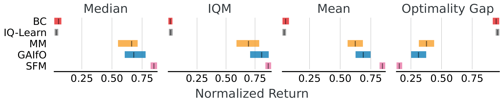

# Successor Feature Matching (SFM) with Intrinsic Reward Bonus

> **This fork** extends [Kumar et al. (2025)](https://openreview.net/forum?id=LvRQgsvd5V)'s Successor Feature Matching (SFM) algorithm with an *intrinsic reward* derived from the variance of successor features. The goal is to encourage exploration in under-visited state regions.

## 🔍 Key Contributions

- Added an **intrinsic reward** term:  
  \[
  r = r_{\text{env}} + \alpha \cdot \text{Var}(\psi(s))
  \]  
  where \(\psi(s)\) is the successor feature for state \(s\), and \(\alpha\) is a tunable coefficient.

- Modified agents:
  - `sfm_td7.py` — main logic for training with intrinsic rewards.
  - `sfm_utils.py` (if needed) — successor feature tracking and variance computation.

- New CLI flag:
  ```bash
  --use_intrinsic_reward    # Enables variance-based bonus


This work proposes Successor Feature Matching (SFM) a state-only non-adversarial algorithm for matching expected features between the agent and the expert. Specifically, SFM derives a feature-matching imitation policy by __direct policy optimization__ via policy gradient descent, and __learns the state-only base features__ simultaneously during training. This reduction to RL allows using any off-the-shelf RL policy optimizer-- as we conduct experiments with backbones analgous to TD3 and TD7. 



## Setup
We use ```pdm``` to manage the dependencies. This repository makes use of [Jax](https://github.com/google/jax), [Flax](https://github.com/google/flax), [Optax](https://github.com/google-deepmind/optax) and [Chex](https://github.com/google-deepmind/chex). Using the ```pdm.lock``` file, the dependencies can be installed by running the following commands:

```
pdm venv create
pdm install  
````
To instantiate the environment
```
eval $(pdm venv activate)
export PYTHONPATH=$PYTHONPATH:/path/to/SFM
```

## Generating Expert Demonstrations
The expert demonstrations used for this project are provided in the ```expert\${ENV_NAME}``` where ```ENV_NAME``` denotes the name of the environment. 
To generate new expert demonstrations, we used TD3 algorithm implemented ```sbx-rl``` which can be run using ```python expert/collect_demos.py```.

## Training
The following command trains an agent
```
python agents/${AGENT}_${POLICY} --env $ENV_NAME --seed $SEED 
```
where ```AGENT``` takes values ```sfm``` for our method SFM, ```mm``` for state-only Moment Matching (MM) and ```gaifo``` for GAIfO, and ```POLICY``` takes values ```td7``` and ```td3``` to use the TD7 or TD3 based policy optimization algorithm.

#### Example
For training ```MM``` with TD7-policy optimizer on ```cheetah_run``` environment.
```
python agents/mm_td7.py --env cheetah_run --seed 1
```

For training ```SFM``` with TD3-based policy optimizer and ```fdm``` as the base feature function. We provide implementations of FDM, IDM, HR and Random as the base feature functions in this work.   
```
python agents/mm_td7.py --env cheetah_run --seed 1 --phi_name fdm
```

For training Behavior Cloning (BC) on ```cheetah_run``` environment, run
```
python agents/bc.py --env cheetah_run --seed 1
```

## Citation
If you build on our work or find it useful, please cite it using the following bibtex.

```bibtex

@inproceedings{
    jain2025nonadversarial,
    title={Non-Adversarial Inverse Reinforcement Learning via Successor Feature Matching},
    author={Arnav Kumar Jain and Harley Wiltzer and Jesse Farebrother and Irina Rish and Glen Berseth and Sanjiban Choudhury},
    booktitle={The Thirteenth International Conference on Learning Representations},
    year={2025},
    url={https://openreview.net/forum?id=LvRQgsvd5V}
}
```

## License

This project is licensed under the MIT License - see the [LICENSE.md](LICENSE.md) file for details.